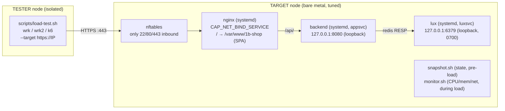

# 1B Nginx — One Billion Concurrent Users on a Single Nginx Instance

A performance-engineering guide and fully reproducible repository that progressively
tunes a Linux system and Nginx to handle extreme concurrency. Each optimization layer
is measured before and after, so every improvement is visible and attributable. The
thesis: bare metal, correctly configured, beats an equivalently priced cloud VM by
orders of magnitude.

The demo workload is a minimal React + Rust e-commerce app that exists only to generate
realistic static + dynamic traffic so concurrency numbers are meaningful, not synthetic.

## Architecture

Two nodes. The **target** is the tuned bare-metal box under test; the **tester** is a
separate, isolated machine that generates load. They're kept apart on purpose — running
the load generator on the target steals CPU/IRQs from the thing being measured.



- **No Docker on the target.** App components run as **systemd** services so the kernel,
  network stack, NUMA topology, and NIC tuning the layers exercise are the *real* host's —
  not a container's namespaced copy. (Docker is kept in [`dev/`](dev/) for local dev only.)
- **Frontend**: React + Vite, built to static files served directly by nginx from
  `/var/www/1b-shop`. Paginated dashboard; one shared bundled image for all products.
- **Backend**: Rust + Axum, bound **loopback-only** (`127.0.0.1:8080`). Connects to lux via
  `redis-rs` (auto-reconnecting `ConnectionManager`); seeds 100 products / 500 orders on
  startup (idempotent). Runs as the unprivileged `appsvc` user.
- **DB**: [lux](https://github.com/lux-db/lux) — Redis-compatible (RESP) server, **loopback-
  only** on `:6379`, as the `luxsvc` user with a `0700` data dir.
- **Security**: TLS 1.2/1.3 + HSTS, strict CSP and security headers, nftables default-drop
  firewall, and systemd sandboxing on every service. See [Section 15](docs/sections/15-security.md).

## Hardware Tiers

| Tier | Description | Provider | Cost |
|------|-------------|----------|------|
| **T1 — Entry Bare Metal** | `m4.metal.small` — AMD EPYC 4244P (6C/12T @ 3.8 GHz), 64 GB DDR5, 2× 960 GB NVMe, 2× 10 GbE | Latitude.sh | **$0.41/hr** |
| **T2 — Mid Bare Metal** | 32-core, 128 GB RAM, 25 GbE NIC | Latitude.sh | — |
| **T3 — High-End Bare Metal** | 128-core, 512 GB RAM, 100 GbE NIC | Latitude.sh | — |

T1 is the project's thesis in miniature: $0.41/hr buys roughly the same as an 8-vCPU
shared cloud VM (e.g. c5.2xlarge) — but here it's 6 dedicated Zen 4 cores, a real NIC,
real NUMA, and no hypervisor. Tuned to its limit, the efficiency comparison is made in
**RPS per core and RPS per dollar-hour**, not raw connection counts.

Each tier starts from the same baseline and applies the same progressive tuning, making
the improvement delta clearly visible across hardware.

## Sections

| # | Section | Doc |
|---|---------|-----|
| 00 | Prerequisites & Hardware Setup | [docs/sections/00-prerequisites.md](docs/sections/00-prerequisites.md) |
| 01 | The Demo App | [docs/sections/01-demo-app.md](docs/sections/01-demo-app.md) |
| 02 | Baseline Measurement | [docs/sections/02-baseline.md](docs/sections/02-baseline.md) |
| 03 | Layer 1 — File Descriptors & Socket Buffers | [docs/sections/03-layer-01-fd.md](docs/sections/03-layer-01-fd.md) |
| 04 | Layer 2 — Linux TCP/IP Kernel Tuning | [docs/sections/04-layer-02-tcp.md](docs/sections/04-layer-02-tcp.md) |
| 05 | Layer 3 — Nginx Worker & Event Model | [docs/sections/05-layer-03-events.md](docs/sections/05-layer-03-events.md) |
| 06 | Layer 4 — Memory Allocator (jemalloc) | [docs/sections/layer-04-jemalloc.md](docs/sections/layer-04-jemalloc.md) |
| 07 | Layer 5 — TLS Hardening & Session Resumption | [docs/sections/07-layer-05-tls.md](docs/sections/07-layer-05-tls.md) |
| 08 | Layer 6 — Async File I/O | [docs/sections/layer-06-aio.md](docs/sections/layer-06-aio.md) |
| 09 | Layer 7 — NUMA & CPU Affinity | [docs/sections/09-layer-07-numa.md](docs/sections/09-layer-07-numa.md) |
| 10 | Layer 8 — DPDK & Kernel Bypass | [docs/sections/layer-08-dpdk.md](docs/sections/layer-08-dpdk.md) |
| 11 | Hardware Tiers Compared | [docs/sections/11-tiers.md](docs/sections/11-tiers.md) |
| 12 | Advanced: FreeBSD Networking Stack | [docs/sections/12-freebsd.md](docs/sections/12-freebsd.md) |
| 13 | Results Summary & Takeaways | [docs/sections/13-results.md](docs/sections/13-results.md) |
| 14 | Appendix: Custom Kernel Build | [docs/sections/14-kernel-build.md](docs/sections/14-kernel-build.md) |
| 15 | Security Hardening & Attack-Surface Reduction | [docs/sections/15-security.md](docs/sections/15-security.md) |

## Prerequisites

- **Target node** — Debian 13 (Trixie) or 12 (Bookworm) minimal, bare metal. Everything else (nginx,
  Rust ≥ 1.85, Node 20, numactl, nftables, libaio) is installed by `install-target.sh`.
- **Tester node** — a separate VM/instance with `wrk`, `wrk2`, `k6`.
- See [docs/sections/00-prerequisites.md](docs/sections/00-prerequisites.md) for the full
  two-node setup and load tooling.

## Quick Start

**On the target** (bare-metal Debian 12) — one script provisions the whole stack:

```bash
git clone https://github.com/alvarotolentino/nginx-at-scale.git && cd nginx-at-scale
sudo scripts/install-target.sh        # nginx + backend + lux (systemd), TLS, firewall, baseline

# Apply the first optimization layer and snapshot the box state
sudo scripts/apply-layer-1.sh
```

**During the load window, on the target** — sample what the load costs the box:

```bash
scripts/monitor.sh --label layer-1 --tier 1 --duration 45 &   # CPU/mem/net/socket time series
```

**On the tester** (separate node) — generate load against the target:

```bash
scripts/load-test.sh --target https://<target-ip> --label layer-1 --tier 1
```

Full sweep (target applies + snapshots every layer, pausing for the tester between each —
the monitor is started/stopped automatically around each pause):

```bash
sudo scripts/apply-all-layers.sh --tier 1
# copy the tester's results back, then:  scripts/generate-report.sh --tier 1 --cost 0.41
# → results/tier-1/REPORT.md  (tester view + target view + RPS/core + RPS per $/hr)
```

## Measurement model — both sides of the wire

Every labeled run produces **three** result sets, merged by `--label`:

| Side | Script | When | What it captures |
|------|--------|------|------------------|
| Target | `snapshot.sh` | before load | Box *state*: kernel params, nginx config, topology, allocator |
| Target | `monitor.sh` | **during** load | Box *cost*: CPU (total, busiest core, %softirq), per-service CPU/RSS via cgroups, NIC Mbps/pps, open sockets/TIME-WAIT, retransmits, accept-queue drops — 2 s time series + summary |
| Tester | `load-test.sh` | during load | Client *experience*: RPS, latency percentiles, transfer/s, socket + HTTP errors |

`generate-report.sh` joins them into one report so each layer answers not just "did RPS
go up" but "**what did it cost**, and what is the wall now" — CPU-bound, one core pegged
on softirq, NIC at line rate, or accept queue overflowing. With `--cost`, it also computes
**RPS per $/hr**, the number that makes bare metal vs cloud comparable.

> Just want to poke at the app locally? The Docker stack in [`dev/`](dev/) brings it up in
> one command — but it is **not** the benchmark target (containers hide the very tuning
> this project measures).

## Build optimizations

The frontend and backend are compiled for production-grade efficiency:

| Side | Optimizations |
|------|---------------|
| **Frontend** | `target: es2020`, esbuild minify, `drop: [console, debugger]`, no sourcemaps, vendor chunk split, **gzip + brotli precompression** |
| **Backend** | `opt-level=3`, fat LTO, `codegen-units=1`, `panic=abort`, **`strip`**, `target-cpu=x86-64-v3` (→ `native` on dedicated bare metal); loopback-only bind, runs as `appsvc` |
| **Nginx** | `gzip_static on` serves the precompressed assets in the tuned configs (zero runtime compression CPU); `brotli_static` available if built with `ngx_brotli` |

> `target-cpu=x86-64-v3` needs a CPU from ~2015+ (AVX2). On older hardware switch to
> `x86-64-v2` in [app/backend/.cargo/config.toml](app/backend/.cargo/config.toml).

## Repository Layout

```
app/                       React frontend + Rust backend (loopback-only, RESP client)
  backend/.cargo/          codegen flags (target-cpu)
  backend/Dockerfile       backend image — used only by the dev/ Docker stack
deploy/
  systemd/                 lux.service, backend.service, nginx hardening drop-in
  firewall/                nftables.conf (default-drop; only 22/80/443)
nginx/                     baseline.conf, per-layer configs (loopback upstream, /var/www/1b-shop)
kernel/                    sysctl.d snippets per layer
benchmarks/                wrk Lua scripts, k6 scenarios
scripts/                   install-target.sh, apply-layer-N.sh, apply-all-layers.sh,
                           snapshot.sh + monitor.sh (target), load-test.sh (tester),
                           generate-report.sh [--cost $/hr]
results/                   benchmark output per tier (<label>/{snapshot,monitor,load})
docs/                      written guide sections
dev/                       Docker Compose — LOCAL DEV ONLY, not the benchmark target
```

> **Note:** 1B concurrent is the theoretical ceiling on T3 hardware. Each tier documents
> its realistic ceiling in [Section 13](docs/sections/13-results.md).
