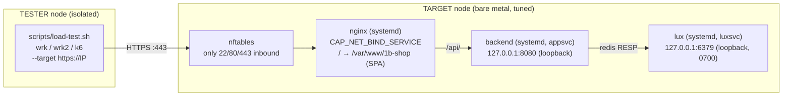

# Section 00 — Prerequisites & Hardware Setup

## Hardware tiers

| Tier | Spec | Provider | Latitude.sh server type |
|------|------|----------|-------------------------|
| **T1 — Baseline** | 4–8 vCPU, 16–32 GB RAM | Any cloud (AWS/GCP/DO) | n/a (cloud VM) |
| **T2 — Mid Bare Metal** | 32-core, 128 GB RAM, 25 GbE | Latitude.sh | `c3.medium.x86` (or current 32-core SKU) |
| **T3 — High-End Bare Metal** | 128-core, 512 GB RAM, 100 GbE | Latitude.sh | `c3.large.x86` (or current 128-core SKU) |

### Provisioning T2 / T3 on Latitude.sh

1. Create a project, then **Deploy → Bare Metal Server**.
2. **Location**: pick a region with the 25/100 GbE SKU in stock.
3. **Server type**: select the 32-core (T2) or 128-core (T3) plan above.
4. **Operating System**: choose **Debian 12 (Bookworm)** — minimal image.
5. Add your SSH key, deploy, and note the public IP.
6. For DPDK (Layer 8) request/confirm a **second NIC** — DPDK claims one NIC entirely;
   you need the other for management/SSH.

> All sysctl and Nginx directives in this guide are pure kernel/Nginx — nothing is
> Debian-specific. They run unmodified on Ubuntu 24.04 LTS after the hardening step
> in [the SPEC](../../SPEC.md) (purge snapd/cloud-init, disable auto-reboot).

## Two nodes

This is a **two-node** setup. Keep them separate — co-locating the load generator on the
target steals CPU/IRQs from the thing you're measuring and pollutes the numbers.

| Node | Role | What runs there |
|------|------|-----------------|
| **Target** | The tuned bare-metal box under test | nginx + backend + lux (systemd), the sysctl/nginx tuning layers |
| **Tester** | A separate, isolated VM/instance | `wrk` / `wrk2` / `k6` load generators only |

## Target node — provisioning

The target is provisioned by one script. On a fresh **Debian 12** box:

```bash
git clone https://github.com/alvarotolentino/nginx-at-scale.git && cd highthroughput
sudo scripts/install-target.sh
```

`install-target.sh` installs nginx + the Rust/Node toolchains, creates the `appsvc` /
`luxsvc` service users, builds the frontend → `/var/www/1b-shop` and the backend →
`/usr/local/bin/1b-backend`, builds lux from source, installs the systemd units (with
sandboxing), generates the self-signed TLS cert, applies the nftables firewall (only
22/80/443 inbound), brings up the baseline nginx config, and runs the target smoke test.

Verify afterwards:

```bash
systemctl is-active lux backend nginx     # all "active"
scripts/smoke-test.sh                      # loopback checks pass
nft list ruleset                           # only 22/80/443 exposed
```

> The backend (`:8080`) and lux (`:6379`) bind to `127.0.0.1` and are never in a firewall
> rule — they're reachable only through nginx, never from the tester or the network.

## Tester node — load tooling

The tester needs only the load generators (no nginx, no Rust, no app):

```bash
sudo apt-get update && sudo apt-get install -y git build-essential curl

# wrk (build from source)
git clone https://github.com/wg/wrk.git /tmp/wrk
make -C /tmp/wrk -j"$(nproc)" && sudo cp /tmp/wrk/wrk /usr/local/bin/

# wrk2 (latency-accurate, constant-rate)
git clone https://github.com/giltene/wrk2.git /tmp/wrk2
make -C /tmp/wrk2 -j"$(nproc)" && sudo cp /tmp/wrk2/wrk /usr/local/bin/wrk2

# k6 (Grafana apt repo)
sudo gpg --no-default-keyring --keyring /usr/share/keyrings/k6-archive-keyring.gpg \
  --keyserver hkp://keyserver.ubuntu.com:80 --recv-keys C5AD17C747E3415A3642D57D77C6C491D6AC1D69
echo "deb [signed-by=/usr/share/keyrings/k6-archive-keyring.gpg] https://dl.k6.io/deb stable main" \
  | sudo tee /etc/apt/sources.list.d/k6.list
sudo apt-get update && sudo apt-get install -y k6
```

Then clone the repo on the tester too (for `scripts/load-test.sh` and the k6 scenarios)
and confirm reachability:

```bash
git clone https://github.com/alvarotolentino/nginx-at-scale.git && cd highthroughput
scripts/smoke-test.sh --target https://<target-ip>   # remote checks pass
```

## Running a layer (the manual two-step)

```bash
# TARGET: apply + snapshot one layer (or the whole sweep with apply-all-layers.sh)
sudo scripts/apply-layer-1.sh

# TESTER: generate load against the target for that same label
scripts/load-test.sh --target https://<target-ip> --label layer-1 --tier 2

# Copy the tester's load/ results back to the target, then build the report there:
scp -r results/tier-2/layer-1/load target:<repo>/results/tier-2/layer-1/
# on TARGET:
scripts/generate-report.sh --tier 2
```

## What you'll build



Next: [Section 02 — Baseline Measurement](02-baseline.md).
