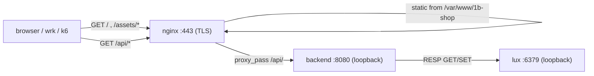

# Section 01 — The Demo App

## Why an app exists at all

The benchmark needs **realistic traffic**, not a single `return 200 "ok"` location.
Real concurrency has a mix: large static assets served from disk, small JSON API
responses that touch a datastore, keepalive reuse, and a browser fetching a bundle then
calling back. A trivial handler would let Nginx cheat — every request hits the same hot
cache line and the numbers stop reflecting a real workload. So the app is a minimal but
**honest** e-commerce SPA. It does the least work that still exercises static delivery,
reverse proxying, and a backing store.

It is deliberately *not* the thing being optimized. The tuning targets Nginx and the
kernel; the app is just the load shape.

## Three processes, one request path

- **Static path** (`/`, `/assets/*`): nginx serves the Vite build straight from
  `/var/www/1b-shop` — `index.html`, the JS/CSS bundle, one shared product image. This is
  the path the static benchmark (`wrk-static.txt`) hammers. With `gzip_static on` nginx
  serves the precompressed `.gz` (or `.br`) twin, so there is **zero runtime compression
  CPU** — the asset is compressed once at build time.
- **Dynamic path** (`/api/*`): nginx reverse-proxies to the Rust backend over the
  loopback upstream. This is the path `wrk-api.txt` measures.

## Frontend — React + Vite, no framework router

A small SPA in [app/frontend/](../../app/frontend/):

- [src/App.jsx](../../app/frontend/src/App.jsx) — a **hand-rolled router** (no
  `react-router`): reads `window.location.pathname`, renders one of three pages, listens
  on `popstate`. Cart count lives in `localStorage`. Keeping the dependency tree tiny
  keeps the bundle small, which keeps the static payload realistic instead of bloated.
- Pages: `ProductList` (paginated dashboard), `ProductDetail`, `Cart`.
- One **shared bundled image** for every product — the point is concurrency, not a CDN of
  distinct images.

Build flags (see [README "Build optimizations"](../../README.md)): `target es2020`,
esbuild minify, `drop: [console, debugger]`, no sourcemaps, vendor chunk split, and
**gzip + brotli precompression** at build time. Vite emits to `nginx/static/`, which
`install-target.sh` copies into the webroot.

## Backend — Rust + Axum, loopback-only

[app/backend/server/src/main.rs](../../app/backend/server/src/main.rs) is a minimal Axum
service. Key properties that matter for the benchmark:

- **Binds `127.0.0.1:8080`** by default — never directly reachable from the network. All
  traffic must enter through nginx. Override only for dev via `BIND_ADDR`.
- **Connects to lux over RESP** using `redis-rs` with an auto-reconnecting
  `ConnectionManager` (cheaply cloneable, shared as Axum state). `connect_with_retry`
  tolerates lux still booting.
- **Seeds 100 products / 500 orders** on startup, idempotently (marker keys gate
  re-seeding), so the API has real data to return.
- Runs as the unprivileged **`appsvc`** user under systemd.

Routes ([handlers.rs](../../app/backend/server/src/handlers.rs)):

| Method | Path | Returns |
|--------|------|---------|
| GET | `/api/products` | all products (JSON array) |
| GET | `/api/products/:id` | one product, or 404 |
| GET | `/api/orders` | all orders (JSON array) |
| GET | `/health` | `200 "ok"` — used by the smoke test |

CORS is **off** in production (same-origin: nginx terminates TLS and proxies `/api/` from
the same host). It is only enabled with `CORS_DEV=1` for the dev container / tester.

## DB — lux (Redis-compatible)

[lux](https://github.com/lux-db/lux) speaks RESP, so the backend talks to it with an
ordinary Redis client. On the target it is **loopback-only on `:6379`**, runs as the
`luxsvc` user with a `0700` data dir, and is never in a firewall rule. It exists to make
the API path touch a real datastore instead of returning a constant.

## Build & install

On the target this is all handled by
[install-target.sh](../../scripts/install-target.sh): it builds the frontend → webroot,
the backend → `/usr/local/bin/1b-backend`, builds lux from source, and installs all three
as hardened systemd units. To poke at the app locally instead, use the Docker stack in
[`dev/`](../../dev/) — but that is **not** the benchmark target (containers hide the
tuning this guide measures).

## What to take into the benchmark

Two distinct load shapes you'll measure separately at every layer:

- **static** — big-ish precompressed assets off disk → stresses FDs, sendfile, the event
  loop, TLS handshakes.
- **API** — small JSON, proxied to a loopback upstream that hits a datastore → stresses
  upstream keepalive, the proxy path, and the backend.

Next: [Section 02 — Baseline Measurement](02-baseline.md).
